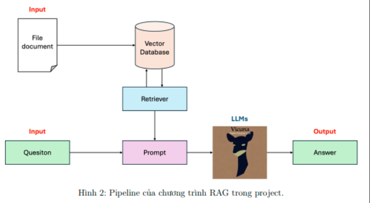

# RAG Project Module 1 - AIO 2024

## 1. Giới thiệu: 
**Large Language Models (LLMs)** (Tạm dịch: Các mô hình ngôn ngữ lớn) là loại mô
hình cho phép người dùng nhập vào một văn bản với nội dung bất kì, thường sẽ là các yêu cầu
hoặc câu hỏi. Từ đó, mô hình sẽ trả về câu trả lời dưới dạng văn bản thỏa mãn yêu cầu của
người dùng. Các ứng dụng phổ biến nhất về ***LLMs*** có thể kể đến như ChatGPT, Gemini...

Trong ***LLMs***, **Retrieval Augmented Generation (RAG)** là một kỹ thuật giúp ***LLMs*** cải
thiện chất lượng kết quả tạo sinh bằng cách tích hợp nội dung truy vấn được từ một nguồn tài
liệu nào đó để trả lời cho một câu hỏi đầu vào. Trong project này, chúng ta sẽ tìm hiểu cách xây
dựng một chương trình RAG cơ bản. Đồng thời, ứng dụng chương trình vào việc hỏi đáp tài liệu
bài học trong khóa AIO. Theo đó, Input và Output của chương trình là:

    • Input: File tài liệu cần hỏi đáp và một câu hỏi liên quan đến nội dung tài liệu.
    • Output: Câu trả lời

## 2. Thực nghiệm

***Lưu ý rằng, phương án sử dụng localtunnel là một phương án truy cập vào localhost trên Colab đơn giản nhưng 
có thể có lúc không hoạt động được. Nếu có máy tính có GPU, có thể đưa code này chạy ở máy để tiện sử dụng 
và đảm bảo đầu ra hơn.***
- Đối với Google Colab, thực hiện chạy từng cell từ trên xuống dưới

    * Nếu muốn thực nghiệm với file PDF khác, có thể tải file PDF lên và thay đường dẫn vào `FILE_PATH = 'your_path'`
- Thực hiện trên máy tính cá nhân, thực hiện cài đặt các thư viện cần thiết dướI dây

    *  Khởi tạo môi trường qua câu lệnh `conda create [name_environment]` và khởi động môi trường `conda activate [name_environment]`
    *  Rồi cài đặt các package theo file requirements.txt dựa trên câu lệnh này `pip install -r requirements.txt`

